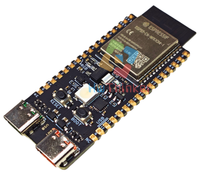
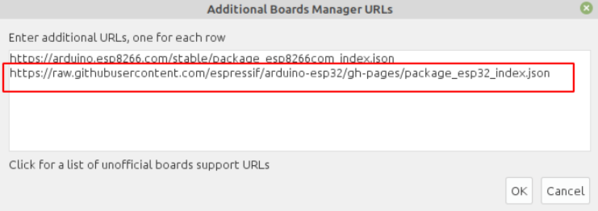
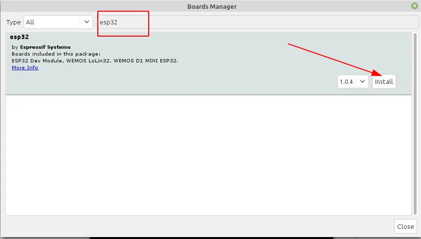
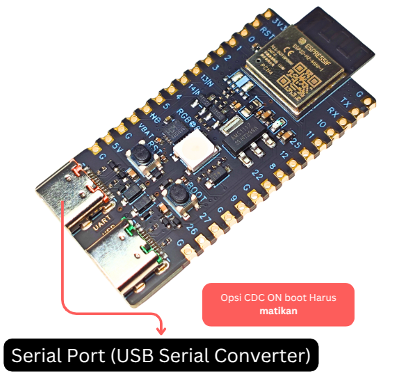

# Tutorial  Weact ESP32-H2



| Perangkat | Pin/Alamat | Keterangan                |
| --------- | ---------- | ------------------------- |
| WS2812B   | GPIO8      | LED RGB addressable       |


[TOC]

## Install Board

1. Masuk ke preferences


2. Klik Additional Board Manager


3. Tambahkan board esp32 kalimat berikut https://raw.githubusercontent.com/espressif/arduino-esp32/gh-pages/package_esp32_index.json



4. Pilih Tools -> Board -> Board Manager


5. Search ESP32 kemudian klik install



6. Pilih Tools -> Board -> ESP32 -> esp32H2 dev Module


7. Langkah berikutnya adalah memastikan Arduino mengetahui Kapasitas Flash yang tersedia. ini dilakukan dengan cara mengatur konfigurasi "Flash Size".  Sesuaikan Flash anda menggunakan konfigurasi seperti pada gambar berikut


8. Setting port serial , untuk windows bisa cek device manager, pastikan anda telah install driver serial usb anda, bila tidak dikenali di windows install driver serial tersebut melalui link https://www.wch-ic.com/search?q=CH343&t=downloads


## Contoh Kode Program

### Test WS2812 menggunakan library FASTLED

LED WS2812 adalah jenis LED RGB dengan pengontrol bawaan yang memungkinkan setiap LED dikendalikan secara individual menggunakan satu pin data. Untuk mempermudah pengendalian LED ini, kita dapat menggunakan library **FASTLED** yang menyediakan fungsi-fungsi intuitif untuk membuat efek cahaya yang menarik. Panduan berikut akan membantu Anda menginstal library FASTLED di Arduino IDE dan menguji contoh kode sederhana untuk mengontrol LED WS2812.

#### Langkah-langkah Instalasi Library FASTLED

Pastikan library **FASTLED** telah terinstal di Arduino IDE Anda. Jika belum, ikuti langkah-langkah berikut:

1. Klik ikon **Library Manager** di panel **sidebar** Arduino IDE.
2. Ketik **FastLED** di kolom pencarian.
3. Temukan library **FastLED by Daniel Garcia**.
4. Klik tombol **Install** untuk menginstalnya.


#### Menggunakan Contoh Kode

Setelah library terinstal, buat file baru atau buka contoh program di **File -> Examples -> Basics -> BareMinimum**.  kemudain yang harus anda lakukan adalah:

1. Gantikan kode yang ada dengan kode berikut:

```c++
#include "FastLED.h"

#define DATA_PIN 8       // Pin data LED
#define LED_TYPE WS2812  // Tipe LED
#define NUM_LEDS 1       // Jumlah LED
#define COLOR_ORDER GRB  // Urutan warna

CRGB leds[NUM_LEDS];
uint8_t brightness = 128;

void setup() {
  FastLED.addLeds<LED_TYPE, DATA_PIN, COLOR_ORDER>(leds, NUM_LEDS);
  FastLED.setBrightness(brightness);
}

void loop() {
  leds[0] = CRGB::Green;
  FastLED.show();
  delay(50);
  
  leds[0] = CRGB::Black;
  FastLED.show();
  delay(50);
}
```


## Upload program

Bila tampilan seperti ini maka anda harus mengkonfigurasi ESP32 anda agar bisa melakukan download

```
- ---esptool.py v3.0-dev
- ---Serial port COM…
- ---Connecting........_____....._____.....__
```

Langkah yang harus dilakukan

- Tekan dan tahan tombol Boot/0  
- Klik(tekan dan lepas) tombol reset/EN sambil tetap tekan tombol Boot .
- Lepas tombol boot
- Klik tombol upload pada Arduino IDE, bila sukses akan menampilkan info

```cpp
- ---Compressed 261792 bytes to 122378...
- ---Writing at 0x00010000... (12 %)
- ---Writing at 0x00014000... (25 %)
- ---Writing at 0x00018000... (37 %)
```

- Setelah selesai Wajib klik tombol **reset** sekali lagi untuk berpindah dari mode download menjadi mode run

> [!NOTE]  
> INGAT YA WAJIB Di Klik Tombol RESET setelah proses upload selesai, tanpa itu program yang baru diupload tidak akan dijalankan


## Menggunakan library Adafruit

Library **Adafruit NeoPixel** adalah pilihan lain yang populer untuk mengontrol LED WS2812 dan jenis LED serupa. Library ini menyediakan fungsi yang mudah digunakan untuk mengontrol warna dan efek pencahayaan pada strip atau matriks LED. Berikut adalah panduan singkat untuk menginstal library ini dan contoh kode sederhana untuk mengontrol LED WS2812.

#### Langkah-langkah Instalasi Library Adafruit NeoPixel

1. Buka Arduino IDE, lalu klik ikon **Library Manager** di panel **sidebar**.
2. Ketik **Adafruit NeoPixel** di kolom pencarian.
3. Temukan library **Adafruit NeoPixel by Adafruit**.
4. Klik tombol **Install** untuk memasangnya, lebih jelas lihat gambar berikut


#### Contoh Kode Mengontrol WS2812

Gunakan kode berikut untuk mengontrol satu LED WS2812 yang menyala berwarna merah selama 1 detik:

```c++
#include <Adafruit_NeoPixel.h>

#define PIN        8 
#define NUMPIXELS  1

Adafruit_NeoPixel pixels(NUMPIXELS, PIN, NEO_GRB + NEO_KHZ800);

void setup() {
  pixels.begin();
}

void loop() {
  pixels.setPixelColor(0, pixels.Color(255,0,0)); 
  pixels.show();
  delay(1000);
  pixels.setPixelColor(0, pixels.Color(0,0,0)); 
  pixels.show();
  delay(1000);
}
```

5. Bila sudah selesai upload program dan kemudian lihat hasilnya

6. Bila berhasil LED RGB WS2812 akan LED akan berkedip  dengan nyala warna merah saat ON

**Catatan:**

- Ganti warna LED dengan nilai RGB yang diinginkan menggunakan `pixels.Color(red, green, blue)`.


## Akses Serial Port di ESP32

Board **ESP32-H2 ** ini mendukung upload dan komunikasi data serial ke komputer dengan dua Mode:

- Mode  USB Serial konverter ch343
- Mode Native USB

Pengaturan ini konfigurasi ini ada dua hal yaitu pengaturan Hardware dan pengaturan Software.  untuk pengaturan hardware bisa dilihat pada gambar dibawah ini:

### Mode USB Serial konverter (default manufaktur)




Pada mode ini Komunikasi Serial ditangani oleh chip usb serial CH343. Pastikan posisi switch dipindah ke serial usb. Untuk memerika apakah mode sudah mode Serial USB, dilinux bisa dicek dengan menggunakan perintah *lsusb*. bila dijalankan hasilnya akan seperti ini:


Pastikan juga data serial  di arahkan ke Serial USB CH343 ini dan bukannya ke native USB, ini dilakukan dengan cara mendisable  opsi "USB CDC on boot". Langkah mendisable USB CDC on boot ini bisa di cek pada gambar dibawah ini


- Jalankan kode sederhana ini

```c++
void setup() {
  // initialize both serial ports:
  Serial.begin(9600);
  while(!Serial);
}

void loop() {
  Serial.println("hello world");
  delay(500);
}
```

- Klik **Verify** untuk memeriksa kode. 
- Klik **Upload** untuk mengunggah kode ke ESP32-H2.
- Bila sudah selesai Silahkan buka Tools -> Serial Monitor
- Atur baud rate di pojok kanan bawah menjadi **9600** (sesuai dengan `Serial.begin(9600)` di kode).
- Anda akan melihat teks **"hello world"** muncul setiap 500ms.


### Mode Native USB untuk Upload dan komunikasi data


Pada mode ini Komunikasi Serial ditangani oleh native USB yang merupakan fitur yang ada di ESP32-H2. untuk mengaktikan mode ini  Pastikan posisi switch dipindah ke native USB. Untuk memerika apakah mode sudah native USB dilinux bisa dicek dengan menggunakan perintah *lsusb*. bila dijalankan hasilnya akan seperti ini:


Untuk pengaturan konfigurasi software pastikan data serial  di arahkan Native USB  dengan cara  konfigurasi  USB CDC on Boot  enablekan.  Pengaturan ini memastikan board dapat menggunakan port USB internal untuk komunikasi serial.


- Jalankan kode sederhana ini

```c++
void setup() {
  // initialize both serial ports:
  Serial.begin(9600);
  while(!Serial);
}

void loop() {
  Serial.println("hello world");
  delay(500);
}
```

- Klik **Verify** untuk memeriksa kode. 
- Klik **Upload** untuk mengunggah kode ke ESP32-H2.
- Bila sudah selesai Silahkan buka Tools -> Serial Monitor
- Atur baud rate di pojok kanan bawah menjadi **9600** (sesuai dengan `Serial.begin(9600)` di kode).
- Anda akan melihat teks **"hello world"** muncul setiap 500ms.


## Diskripsi PIN GPIO


## Pemecahan Masalah

### A. Port Com  tidak dapat dikenali di Arduino

Bila port COM di windows tidak dikenali pastikan install driver terlebih dahulu ada  beberapa kemungkinan yaitu permasalaha di chip, permasalah di usb serial, permasalahan di kabe dan permasalahan di komputer. 

### 1. Belum install  driver USB

Permasalahan yang umum adalah berlum install driver usb serial. driver usb serial di board ini menggunakan driver ch343 yang dapat diunduh melalui google dengan kata kunci "download driver ch343" atau bisa juga langsung ke situs manufakturnya. 

### 2. Permasalahan kabel USB
Bila masih belum dikenali kemungkinan Kabel USB bukan merupakan kabel data melainkan kabel power saja. Jadi pastikan menggunakan kabel data yang berkualitas yang pendek (maksimal 1m). bila tidak dikenali juga coba di pindah port usb lainnya di komputer tersebut atau menggunakan komputer lainnya.  

### 3. Belum masuk Mode Bootloader

Belum masuk mode bootloader juga menyebebkan komputer tidak mengenali device ESP32. Untuk mengatasi ini caranya cukup simple yaitu dengan menekan tombol tertentu yang ada di ESP32 sehingga bisa masuk mode bootloader. untuk masuk ke mode bootloader  caranya sebagai berikut:

- Tekan dan tahan tombol Boot/0  
- Klik(tekan dan lepas) tombol reset/EN sambil tetap tekan tombol Boot .
- Lepas tombol boot
- Setelah selesai Wajib klik tombol **reset** sekali lagi untuk berpindah dari mode download menjadi mode run

### B. Program tidak dapat berjalan setelah diunggah

Setelah upload berhasil, Anda perlu menekan tombol Reset sebelum dapat dijalankan.

